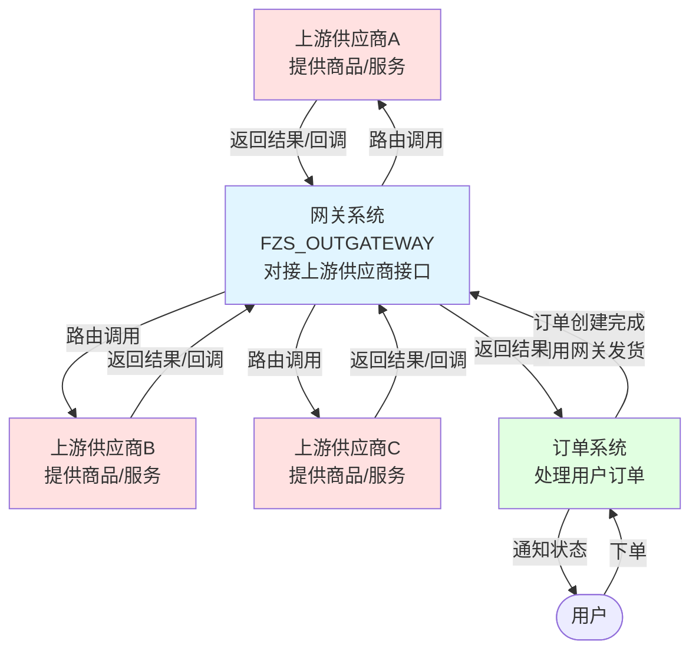

# FZS_OUTGATEWAY 网关业务模型

## 一、业务背景与价值

### 1.1 业务痛点

业务系统在对接多个外部供应商API时，面临以下核心问题：

**1. HTTP调用代码量大**：订单系统有多种订单类型（直充类、卡密类、实物类、业务办理类），每种类型对接的供应商接口规范都不同（参数格式、签名算法、响应结构等）。传统方式需要为每个供应商编写HTTP调用代码，包括构建请求参数、发送HTTP请求、签名计算、解析响应等。例如，对接50家供应商需要编写50套HTTP调用代码，开发和维护成本高。

**2. 回调处理不统一**：不同供应商的异步回调机制各不相同，业务系统需要为每个供应商开发独立的回调接口。例如，对接20家支付渠道需要开发20个回调接口，管理混乱且存在安全隐患。

**3. 缺乏统一治理**：供应商接口调用分散在各业务系统中，无法统一监控、日志追踪、限流熔断。接口故障时难以快速发现和定位问题，影响业务稳定性。

**4. 配置管理混乱**：即使使用配置中心管理供应商配置，也存在修改不直观、容易缺少注释说明、所有配置混在一起导致配置文件很长等问题。对接的供应商越多，配置文件越难以维护和理解。

### 1.2 业务定位

FZS_OUTGATEWAY是一个**API网关管理平台**，通过统一的接口管理、可视化配置、动态策略路由、标准化回调处理等能力，彻底解决业务系统对接多个外部供应商API时面临的上述痛点。

**业务链路位置**：



**角色说明**：
- **上游供应商**：提供商品/服务的第三方（如商品供应商、物流商、支付渠道等）
- **网关系统**：本系统（FZS_OUTGATEWAY），对接上游供应商接口，提供统一的调用入口
- **订单系统**：网关的调用方，订单创建完成后调用网关进行发货等操作
- **订单系统与网关系统**：平级关系，网关是订单系统调用的工具系统

### 1.3 核心价值

**1. 抽象化HTTP调用过程**：通过Web界面可视化配置接口URL、请求参数、签名算法、响应解析等，网关系统自动完成HTTP请求的构建、发送和解析。支持Aviator表达式处理参数转换和签名计算等复杂逻辑，无需编写HTTP调用代码，大幅降低新增供应商的开发成本。

**2. 统一回调处理**：提供统一的回调接入地址，通过配置适配不同供应商的回调格式和签名验证。对接多家渠道只需开发一个回调接口，大幅降低开发工作量。

**3. 全链路监控治理**：统一监控各供应商接口的调用量、成功率、响应时间等指标，记录完整的调用日志。支持异常告警、限流熔断，快速发现和定位问题。

**4. 可视化配置管理**：通过Web界面结构化管理供应商配置，每个供应商的配置独立展示，修改直观便捷。支持在配置界面添加说明注释，便于团队理解和维护，配置修改后立即生效。

### 1.4 典型应用场景

**典型业务流程**（以发货为例）：

1. 用户在前端下单
2. **订单系统**创建订单记录
3. 订单创建完成后，**订单系统调用网关系统**进行发货
4. **网关系统**根据策略路由到合适的供应商接口（供应商A/B/C）
5. **供应商接口**执行发货操作，返回结果或异步回调
6. **网关系统**返回结果给订单系统
7. **订单系统**更新订单状态，通知用户

---

## 二、核心业务概念

### 2.1 接口服务

> **页面对应**：本章节对应前端 **接口服务管理** 页面。

**业务定义**：接口服务是网关对外提供或对接外部的API接口抽象，是网关的核心业务对象。

**业务职责**：

- 定义接口的调用地址、方式、超时等基本信息
- 配置接口的请求参数如何构造
- 定义接口的响应数据如何解析
- 关联业务策略决定接口的调用逻辑
- 管理接口的生命周期（草稿、启用、禁用）

**核心业务属性**：

- **接口编码**：接口的唯一业务标识
- **接口名称**：接口的业务描述
    - **命名规则**：【供应商名称】+【能力】
    - **示例**：爱奇艺直充下单、腾讯视频查询订单、支付宝充值接口
- **接口地址**：实际调用的URL
- **接口类型**：
    - 接入服务：用户下单时调用的接口
    - 校验服务：下单前的校验接口（如库存、价格校验）
    - 下单后服务：订单完成后的后续处理接口
    - 其他：其他类型的接口
- **接口子类型**（可选，用于进一步细分接口用途）：
    - 业务办理短信下发
    - 业务办理下单
    - 订单状态同步
    - 号卡下单
    - **业务作用**：
        - 作为分类标识，标识接口的具体业务场景
        - 关联预定义参数模板，每个子类型都有对应的内置参数规范
        - 在配置界面自动展示该子类型的内置参数列表，提供配置参考
        - 规范化接口参数配置，确保同类型接口使用统一的参数标准
        - 简化配置流程，降低配置错误率
- **处理器**（必选）：
    - 选择处理接口调用的处理器类型
    - 常用处理器：标准HTTP处理器、RPC处理器、MQ处理器等
    - 详见 2.3 处理器章节
- **发货确认方式**：
    - 无需回调：同步返回结果，调用即完成
    - 回调：供应商异步回调通知结果
    - 主动轮询：我方主动查询结果，需要配置状态同步接口服务
- **状态同步接口服务**（可选，用于主动轮询场景）：
    - **概念**：关联另一个已配置的接口服务，用于查询订单/发货状态
    - **使用场景**：
        - 当发货确认方式选择"主动轮询"时配置
        - 发货接口返回"处理中"状态后，订单系统需要轮询查询最终结果
        - 标准HTTP处理器在返回结果中会包含关键字段：
            - `shipConfirmType`：发货确认方式，告知订单系统是否需要轮询
            - `execStateQueryInterfaceId`：状态查询接口ID（未配置时为null），用于轮询调用
            - `resultStatus`：当前处理状态（processing/success/fail）
        - 订单系统判断发货确认方式为"主动轮询"且`execStateQueryInterfaceId`不为null时，使用该ID作为`gatewayCode`再次调用网关查单接口
    - **配置方式**：在接口服务配置页面选择已有的查询接口服务
    - **典型场景**：
        - 异步下单接口需要配置订单状态查询接口
        - 支付接口需要配置支付结果查询接口
        - 发货接口需要配置发货状态查询接口
- **业务开关**：
    - **是否保存日志**：
        - 否：不记录调用日志
        - 是：记录完整的调用日志，包括请求参数、响应结果等
    - **是否使用代理IP**：
        - 否：直接调用接口
        - 是：通过代理IP调用接口，适用于有IP白名单限制的场景
    - **是否支持幂等重发**：
        - 否：上游供应商接口不支持幂等，相同发货ID重复调用可能被拒绝或产生非预期行为（如重复发货/扣费）
        - 是：上游供应商接口支持幂等，相同发货ID重复调用会返回一致结果，适用于需要重试的场景
        - **业务含义**：声明上游供应商接口是否支持按发货ID实现幂等，用于指导网关重试策略和订单系统重试行为
        - **典型场景**：
            - 配置为否：上游供应商接口每次调用都会产生新的业务动作，不支持按发货ID去重（如某些物流/支付接口），建议同步配置为"不可重试+不可切换"策略
            - 配置为是：上游供应商接口已实现幂等逻辑，相同发货ID重复调用返回首次结果且不会重复执行业务动作，支持失败重试、切换通道等场景
        - **重要说明：声明式配置，非强制去重**
            - **网关侧行为**：网关本身**不执行**发货ID去重拦截或历史结果复用，仅提供配置标识
            - **幂等实现依赖**：
                - **上游供应商接口支持**：上游供应商接口需按发货ID实现幂等逻辑，相同ID重复调用返回相同结果
                - **调用方（订单系统）规范**：重试时必须严格复用同一发货ID（可通过发货ID配置或订单系统侧参数管理实现）
                - **查单接口补偿**：配合状态同步接口服务，通过查单获取最终态，避免重复动作
            - **与发货ID定义的联动**：
                - 幂等配置为是时，订单系统需自行保证重试时复用同一发货ID
                - 幂等配置为否时，每次调用都是新的发货请求，建议使用 `iShipBillId` 等自动生成的唯一ID
            - **风险提示**：
                - 启用幂等重发前，**务必确认上游供应商接口支持按发货ID幂等**，否则可能导致**重复发货/重复扣费**
                - RPC底层已禁止自动重试，避免框架层误重放；业务侧重试由策略控制
                - 若上游供应商接口不支持幂等，应将策略配置为"不可重试+不可切换"，从策略层止损
            - **返回字段与订单系统约定**：
                - 标准HTTP处理器返回 `iCustomerId`，订单系统需保存到订单发货表，用于后续查单/对账
                - 返回 `execStateQueryInterfaceId`，订单系统根据此ID作为gatewayCode调用网关查单接口
                - 启用幂等重发时，订单系统重试须复用首次调用返回的 `iCustomerId`
- **发货ID定义**：
    - **业务定义**：记录该接口使用的发货ID生成规则，用于配置文档和维护参考
    - **字段特性**：
        - 这是一个**文档记录字段**，用于在配置界面记录发货ID的表达式
        - 该字段**不参与运行时计算**，不能在其他表达式中引用
        - 存储的是表达式字符串（如 `iShipBillId`），而非最终计算结果
    - **实际生效方式**：
        - 该字段仅作为配置文档，真正生效需在【接口参数】中配置 `iCustomerId` 参数
        - 在【Header】或【URL-Param】参数组中添加参数：
            - `paramCode` = `iCustomerId`
            - `paramValue` = 填写具体的表达式（如 `iShipBillId` 或 `'MY_'+iShipBillId`）
        - 网关会从接口参数中提取 `iCustomerId` 的计算结果，作为发货ID返回给调用方
    - **典型表达式**：
        - `iShipBillId` - 每次生成新的发货ID
        - `'CUSTOM_'+iShipBillId` - 自定义前缀的发货ID
    - **使用建议**：
        - 配置该字段有助于团队理解接口的发货ID生成逻辑
        - 修改发货ID规则时，建议同步更新该字段和参数配置
- **接口文档链接**：
    - **业务定义**：存储上游供应商接口的官方技术文档URL地址
    - **使用方式**：
        - 在接口服务配置时填写文档URL（可选）
        - 在接口列表页面通过编辑图标可修改文档链接
        - 点击链接可直接跳转到上游供应商接口文档页面
    - **典型场景**：
        - 对接上游供应商API时，保存供应商提供的接口文档链接
        - 内部接口对接时，保存Swagger文档或内部Wiki链接
        - 方便问题排查时快速查阅接口规范

**业务状态**：

- **草稿**：配置中，未上线
- **启用**：正常提供服务
- **禁用**：临时停用
- **删除**：已废弃

**关联关系**：

- 归属于一个**接口提供者**
- 使用一个**处理器**处理调用逻辑
- 包含多个**接口参数**定义请求
- 包含多个**接口变量**辅助处理
- 包含多个**预定义变量**处理前置逻辑
- 包含多个**我方回参**定义返回
- 关联多个**策略**控制调用行为
- 关联多个**供应商**表示可用供应商

---

### 2.2 接口提供者

**业务定义**：接口提供者是提供API服务的上游供应商或内部系统的抽象。

**业务职责**：
- 标识接口的来源方（上游供应商）
- 便于按提供者维度查询和管理接口
- 支持提供者级别的统计和监控

**典型示例**（上游供应商）：

- 京东API（商品供应商）
- 淘宝客API（商品供应商）
- 某影票供应商API（票务供应商）
- 某物流商API（物流供应商）
- 某支付渠道API（支付供应商）

---

### 2.3 处理器

**业务定义**：处理器负责接口**请求的构建和发送**，是网关调用上游供应商接口的技术执行单元。

**核心职责边界**：

处理器**仅负责请求侧**的处理，响应处理由独立的结果拦截器负责。

✅ **请求阶段（Handler负责）**：
- 构建请求环境变量（加载配置变量、输入参数、内置变量）
- 执行预定义变量的表达式计算
- 计算接口参数的表达式，生成最终参数值
- 构建HTTP请求的Header、URL参数、Body
- 执行HTTP/RPC/MQ等协议调用
- 处理代理IP、超时设置等调用参数
- 获取原始响应

❌ **响应阶段（Handler不负责）**：
- **响应解密**：对加密响应进行解密处理
- **策略匹配**：根据策略判断调用成功/失败/处理中
- **响应解析**：根据我方回参配置提取和转换数据
- **结果构造**：构建返回给调用方的最终响应

> **职责分离说明**：
> - 处理器完成HTTP调用后，将原始响应交给**结果拦截器**
> - 结果拦截器负责响应解密、策略判断、数据解析、结果构造等所有响应侧处理
> - 这种分离使得处理器只关注"如何调用"，拦截器只关注"如何处理响应"
> - 处理器可复用：不同接口可使用同一处理器，通过配置实现差异化

**设计理念**：采用策略模式，通过配置选择不同的处理器，实现一套配置适配多种调用方式。

**典型处理器类型**：

| 处理器类型 | 用途场景 | 关键特性 |
|-----------|---------|---------|
| 标准HTTP处理器 | 普通HTTP接口调用 | 支持GET/POST/DELETE等方法 |
| 拦截式处理器 | 需要前置/后置处理 | 支持before/after钩子 |
| 成功Mock处理器 | 测试成功场景 | 返回固定的成功响应 |
| 失败Mock处理器 | 测试失败场景 | 返回固定的失败响应 |

**处理器选择机制**：

接口配置时指定处理器ID → 系统根据配置加载对应处理器 → 执行该处理器的调用逻辑

**网关调用返回的关键业务字段**：

**订单系统**调用网关接口后，返回结果包含以下业务关键字段：

| 字段名 | 业务含义 | 订单系统需要的处理 |
|-------|---------|------|
| `iCustomerId` | 发货ID | 保存到订单发货表，用于后续查单、对账；幂等重试时需复用此ID |
| `shipConfirmType` | 发货确认方式 | 判断是否需要等待回调或主动轮询（无需回调/异步回调/主动轮询） |
| `execStateQueryInterfaceId` | 查单接口ID | 发货确认方式为主动轮询时，使用此ID作为gatewayCode再次调用网关进行轮询查询 |
| `resultStatus` | 处理状态 | 根据状态更新订单（processing=处理中，success=成功，fail=失败） |

**订单系统处理要点**：
- **发货ID管理**：将 `iCustomerId` 保存到订单发货表，用于对账匹配和问题排查
- **轮询处理**：当 `shipConfirmType=主动轮询` 且 `resultStatus=processing` 时，订单系统需使用 `execStateQueryInterfaceId` 作为 `gatewayCode` 定时轮询网关查单接口获取最终结果
- **幂等重试**：如果调用失败需要重试，必须复用首次调用返回的 `iCustomerId`，避免重复发货

---

### 2.4 接口参数

**业务定义**：接口参数定义了调用上游供应商接口时需要传递的请求参数及其取值规则。

**业务职责**：

- 定义参数的键名（paramCode）
- 定义参数的取值方式（paramValue，Aviator表达式）
- 支持参数分组（groupCode）对应HTTP请求的不同部分
- 提供默认值回退机制（defaultValue）

**参数分组机制**：

通过 groupCode 将参数分为三组，分别对应HTTP请求的不同部分：

| 分组值 | 对应部分 | 说明 | 示例 |
|--------|---------|------|------|
| `header` | 请求头 | HTTP Headers | `Content-Type: application/json` |
| `url` | URL参数 | Query参数或路径参数 | `?productId=123` 或 `/order/{orderId}` |
| `body` | 请求体 | HTTP Body（通常为JSON/XML） | `{"orderId":"123"}` |

**参数值表达式（Aviator语法）**：

参数值（paramValue）使用Aviator表达式，支持以下形式：

```javascript
// 1. 固定字符串
"CNY"
"application/json"

// 2. 直接引用变量（不需要${}）
orderId              // 引用输入参数或配置变量
iTimestamp           // 引用内置变量
accessToken          // 引用预定义变量

// 3. 算术运算
price * 100          // 元转分
quantity * unitPrice // 计算总价

// 4. 字符串拼接
"ORDER_" + orderId
"Bearer " + accessToken
iYYYMMDD + "_" + iUUID

// 5. 函数调用
md5(orderId, iTimestamp, appSecret)
aes_ecb(sensitiveData, aesKey)
url.encode(productName)

// 6. 复杂表达式
md5(orderId + productId + iTimestamp, appSecret)
price > 1000 ? "VIP" : "NORMAL"
accessToken == nil ? "" : accessToken   // Aviator中判断空值使用nil，不使用null
```

> **Aviator空值说明**：在 Aviator 表达式里判断空值请使用 `nil`，例如 `x == nil`、`x != nil`，不要写成 `x == null`。

**取值优先级**：

参数的最终值按以下优先级获取：
1. **表达式计算值**：优先使用Aviator表达式计算的结果
2. **默认值**：表达式为空或计算结果为空时使用

这种机制支持：
- **必填参数**：只配置表达式，不配置默认值
- **可选参数**：配置表达式和默认值，有值传入，无值用默认值
- **固定值参数**：不配置表达式，直接使用默认值

**表达式可引用的变量**：

接口参数的表达式可以引用以下所有变量：

| 变量来源 | 说明 | 示例 |
|---------|------|------|
| 输入参数 | 调用方传入的参数 | `orderId`、`productId` |
| 配置变量 | 接口配置的业务变量和缺省 | `orderType`、`channelId` |
| 系统缺省 | 密钥、AppID等 | `appSecret`、`appKey` |
| 内置变量 | 7个以"i"开头的内置变量 | `iTimestamp`、`iUUID` |
| 预定义变量 | 所有已计算的预定义变量 | `sign`、`accessToken` |

**配置示例**：

> **字段说明**：`groupCode` 对应上述"参数分组机制"表格中的分组值（header、url、body）。

```javascript
// 示例1：请求头参数
{
  paramCode: "Authorization",
  groupCode: "header",
  paramValue: "'Bearer ' + accessToken",  // 拼接预定义变量
  defaultValue: null
}

// 示例2：URL参数，支持默认值
{
  paramCode: "pageSize",
  groupCode: "url",
  paramValue: "pageSize",      // 引用输入参数（可能为空）
  defaultValue: "20"           // 未传入时默认20
}

// 示例3：URL路径参数
// 接口URL配置为：/api/order/{orderId}
{
  paramCode: "orderId",
  groupCode: "url",
  paramValue: "orderId",       // 值会替换URL中的{orderId}
  defaultValue: null
}

// 示例4：请求体（JSON格式）
{
  paramCode: "body",
  groupCode: "body",
  paramValue: "'{\"orderId\":\"' + orderId + '\",\"amount\":' + (price * 100) + ',\"timestamp\":' + iTimestamp + ',\"sign\":\"' + sign + '\"}'",
  defaultValue: null
}

// 示例5：固定值参数
{
  paramCode: "version",
  groupCode: "url",
  paramValue: null,            // 不配置表达式
  defaultValue: "1.0"          // 直接使用固定值
}
```

> 所有表达式使用Aviator引擎执行，支持自定义函数，详见第8章。表达式中直接使用变量名，无需 `${}` 符号。

---

### 2.5 接口预定义变量

**业务定义**：预定义变量是在接口调用前预先计算和准备的中间变量，用于复杂业务逻辑的处理。

**业务职责**：
- 在调用前预先计算复杂表达式
- 准备签名、访问令牌等公共信息
- 调用其他接口获取前置数据
- 为后续的接口参数提供计算好的变量

**执行时机和顺序**：

1. **执行时机**：在环境变量准备完成后、构建接口参数之前执行
2. **执行顺序**：按配置顺序依次计算（顺序很重要！）
3. **作用域规则**：后面的预定义变量可以引用前面已计算的预定义变量

**计算流程示例**：

```javascript
// 假设环境中已有：
// - orderId (输入参数)
// - appSecret (系统缺省)
// - iTimestamp (内置变量)

// 预定义变量1：生成请求ID
requestId = "REQ_" + iYYYYMMDDHHMMSS + "_" + iUUID
// 计算后放入环境：env.requestId = "REQ_20250130143000_a1b2c3d4..."

// 预定义变量2：获取访问令牌（调用其他接口）
accessToken = callGateWay("GET_TOKEN", "appId=12345", "jsonpath=$.token", "token_12345", "7200")
// 计算后放入环境：env.accessToken = "eyJhbGciOiJIUzI1NiIsInR5cCI6IkpXVCJ9..."

// 预定义变量3：计算签名（可引用前面的requestId和accessToken）
sign = md5(orderId, requestId, iTimestamp, appSecret)
// 计算后放入环境：env.sign = "d41d8cd98f00b204e9800998ecf8427e"

// 之后的接口参数可以引用：requestId、accessToken、sign
```

**表达式可引用的变量**：

预定义变量的表达式可以引用：

| 变量来源 | 说明 | 示例 |
|---------|------|------|
| 输入参数 | 调用方传入的参数 | `orderId`、`productId` |
| 配置变量 | 接口配置的业务变量和缺省 | `orderType`、`channelId` |
| 系统缺省 | 密钥、AppID等 | `appSecret`、`appKey` |
| 内置变量 | 7个以"i"开头的内置变量 | `iTimestamp`、`iUUID` |
| 之前的预定义变量 | 已计算的预定义变量（按顺序） | `requestId`、`accessToken` |

**典型用途（Aviator表达式）**：

```javascript
// 1. 生成唯一标识
requestId = "REQ_" + iYYYYMMDDHHMMSS + "_" + iUUID
traceId = iidWorkerId

// 2. 计算签名
sign = md5(orderId, iTimestamp, appSecret)
signature = sha256rsa(orderId + productId + iTimestamp, privateKey)

// 3. 获取访问令牌（调用其他网关接口，支持缓存）
accessToken = callGateWay("GET_TOKEN", "appId=12345", "jsonpath=$.token", "token_12345", "7200")
// 参数说明：
// - "GET_TOKEN": 网关接口编码
// - "appId=12345": 接口参数（URL参数格式）
// - "jsonpath=$.token": 从响应中提取token的JSONPath表达式
// - "token_12345": Redis缓存key
// - "7200": 缓存过期时间（秒）

// 4. 数据转换
priceInCent = price * 100              // 元转分
encryptedData = aes_ecb(data, aesKey)  // AES加密

// 5. 条件判断
userLevel = price > 1000 ? "VIP" : "NORMAL"
discountRate = province == "北京" ? 0.9 : 1.0

// 6. 复杂嵌套表达式
finalSign = md5(
  orderId +
  productId +
  iTimestamp +
  (price > 1000 ? "VIP" : "NORMAL") +
  appSecret
)
```

**配置示例**：

```javascript
// 示例1：简单的字符串拼接
{
  preVarCode: "requestId",
  preVarValue: "'REQ_' + iYYYYMMDDHHMMSS + '_' + iUUID",
  preVarDesc: "请求唯一标识"
}

// 示例2：调用其他网关获取Token（带缓存）
{
  preVarCode: "accessToken",
  preVarValue: "callGateWay('GET_WECHAT_TOKEN', 'appId=wx12345', 'jsonpath=$.access_token', 'wechat_token_wx12345', '7200')",
  preVarDesc: "微信AccessToken"
}

// 示例3：计算MD5签名（引用内置变量和输入参数）
{
  preVarCode: "sign",
  preVarValue: "md5(orderId, productId, iTimestamp, appSecret)",
  preVarDesc: "请求签名"
}

// 示例4：引用前面的预定义变量
{
  preVarCode: "authHeader",
  preVarValue: "'Bearer ' + accessToken",  // 引用前面计算的accessToken
  preVarDesc: "认证请求头"
}
```

**重要特性**：

1. **支持接口间调用**：通过 `callGateWay` 函数调用其他网关接口，实现依赖调用
2. **支持缓存机制**：`callGateWay` 支持Redis缓存，避免频繁调用（如获取Token）
3. **按顺序执行**：预定义变量按配置顺序依次计算，后面可引用前面的结果
4. **一次性计算**：每个预定义变量在一次请求中只计算一次，结果复用

> 预定义变量是处理复杂业务逻辑的关键机制，合理使用可以简化接口参数配置，提升代码复用性。

---

### 2.6 接口变量

**业务定义**：接口变量用于从调用请求或上下文中提取和计算数据，供后续流程使用。

> **与接口参数的区别**：
> - **接口参数（2.4）**：用于构建发送给供应商的HTTP请求参数（Header、URL参数、Body等）
> - **接口变量（2.6）**：用于定义接口使用的变量及其来源（配置变量、输入参数、系统缺省等），供参数计算和策略判断使用

**业务职责**：
- 提取请求中的业务参数
- 解析和转换数据格式
- 计算派生字段
- 为策略判断提供数据

**变量类型**：

接口变量根据用途分为4种类型，不同类型有不同的覆盖规则：

| 类型 | 常量值 | 说明 | 示例 | 可被覆盖 |
|------|--------|------|------|---------|
| **业务变量** | VAR_TYPE_BIZVAR | 用户输入的动态参数 | `mobile`、`orderId` | ✅ 可被输入参数覆盖 |
| **业务缺省** | VAR_TYPE_BIZCONST | 业务固定值 | `orderType`、`channelId` | ✅ 可被输入参数覆盖 |
| **系统缺省** | VAR_TYPE_SYSCONST | 系统固定值（密钥等） | `appSecret`、`appKey` | ❌ 不可被覆盖 |
| **系统变量** | VAR_TYPE_SYSVAR | 系统内置变量 | 见内置变量表 | ❌ 自动注入 |

**变量覆盖规则**：

网关在构建表达式环境时，按以下顺序处理变量（后面的会覆盖前面的）：

```
步骤1：加载所有配置变量（包括业务变量、业务缺省、系统缺省）
       └─ 全部放入环境变量 env

步骤2：应用实际输入参数
       ├─ 将调用方传入的参数放入 env
       └─ 覆盖业务变量和业务缺省的配置值

步骤3：强制覆盖系统缺省
       ├─ 重新将系统缺省的配置值放入 env
       └─ 保护机制：确保系统缺省不被外部输入篡改

步骤4：注入内置变量（7个以"i"开头的变量）
       └─ 自动生成时间、UUID等系统变量

步骤5：计算预定义变量
       └─ 按顺序执行预定义变量的表达式
```

**覆盖示例**：

```javascript
// 接口配置的变量：
配置变量 = {
  mobile: "13800138000",      // 业务变量（可被覆盖）
  orderType: "RECHARGE",      // 业务缺省（可被覆盖）
  appSecret: "secret_key_123" // 系统缺省（不可被覆盖）
}

// 调用方传入的参数：
输入参数 = {
  mobile: "13900139000",
  orderType: "SHOPPING",
  appSecret: "hacker_key"     // 试图篡改密钥
}

// 最终环境变量的值：
env = {
  mobile: "13900139000",      // ✅ 被输入参数覆盖
  orderType: "SHOPPING",      // ✅ 被输入参数覆盖
  appSecret: "secret_key_123", // ❌ 系统缺省不允许被覆盖
  iTimestamp: "1706601000123", // 自动注入
  iUUID: "a1b2c3d4e5f6..."    // 自动注入
}
```

**系统内置变量**：

系统自动提供7个以"i"开头的内置变量，可在所有Aviator表达式中直接使用：

| 变量名 | 说明 | 示例值 |
|--------|------|--------|
| `iYYYMMDD` | 当前日期 | `20250130` |
| `iYYYYMMDDHHMMSS` | 当前日期时间 | `20250130143000` |
| `iDateTimeISO` | ISO格式日期时间 | `2025-01-30 14:30:00` |
| `iUUID` | UUID（无横线） | `1234567890abcdef...` |
| `iTimestamp` | 时间戳（毫秒） | `1706601000123` |
| `iidWorkerId` | 雪花算法ID | `123456789012345678` |
| `iLineBreak` | 换行符 | `\n` |

**变量作用域对比**：

| 变量类型 | 定义位置 | 计算时机 | 作用域 |
|---------|---------|---------|--------|
| 配置变量 | 接口配置 | 加载配置时 | 可在预定义变量和接口参数中引用 |
| 输入参数 | 调用方传入 | 接收请求时 | 可在预定义变量和接口参数中引用 |
| 系统缺省 | 接口配置 | 加载配置时 | 可在预定义变量和接口参数中引用（不可被覆盖） |
| 内置变量 | 系统自动生成 | 构建环境时 | 可在预定义变量和接口参数中引用 |
| 预定义变量 | 表达式计算 | 构建参数前 | 可在后续的预定义变量和接口参数中引用（按顺序） |

**与预定义变量的区别**：
- **预定义变量**：在调用前计算复杂表达式，生成新的变量（如签名、Token）
- **接口变量**：定义接口使用的变量及其来源（配置或输入）
- **内置变量**：系统自动提供的时间、UUID等工具变量

**典型用途**：
- 配置业务变量供调用方传入：`mobile`、`orderId`
- 配置系统缺省保护敏感信息：`appSecret`、`privateKey`
- 使用内置变量构造订单号：`"ORDER_" + iYYYMMDD + "_" + iUUID`

---

## 三、核心业务流程

### 3.1 接口服务配置流程

```
1. 创建接口服务
   ├─ 填写基本信息（编码、名称、URL、类型）
   ├─ 选择接口子类型（可选，系统将自动加载对应的参数模板）
   ├─ 选择发货确认方式
   │  ├─ 无需回调：同步返回结果
   │  ├─ 回调：供应商异步回调
   │  └─ 主动轮询：我方定时查询结果状态
   ├─ 配置状态同步接口服务（仅主动轮询时配置）
   │  └─ 选择已有的查询接口服务
   ├─ 选择接口提供者
   ├─ 选择处理器
   └─ 设置业务开关（日志、代理、幂等）

2. 配置请求参数（如选择了子类型，可参考配置说明面板中的内置参数）
   ├─ 添加接口参数
   │  ├─ 定义参数键名
   │  ├─ 配置参数值（表达式）
   │  └─ 设置默认值
   │
   └─ 添加预定义变量（可选）
      ├─ 准备签名
      ├─ 生成时间戳
      └─ 查询前置数据

3. 配置响应解析
   └─ 添加我方回参
      ├─ 提取业务数据
      ├─ 转换数据格式
      └─ 构建响应结构

4. 关联业务策略（可选）
   └─ 选择已有策略或创建新策略
      ├─ 定义判断条件
      └─ 配置处理规则

5. 关联供应商
   └─ 选择该接口对应的供应商

6. 提交审核（如果需要）
   ├─ 审核人员审批
   └─ 审核通过后接口生效

7. 启用接口
   └─ 接口状态变更为"启用"
```

---

### 3.2 接口调用执行流程

```
第一步：请求接入
   ├─ 客户端发起调用请求
   └─ 网关接收请求

第二步：查找接口配置
   ├─ 根据接口编码查找接口服务
   ├─ 检查接口状态（是否启用）
   └─ 加载完整配置

第三步：执行预定义变量
   ├─ 按顺序执行预定义变量
   ├─ 计算表达式
   ├─ 调用前置接口（如获取token）
   └─ 将结果存入上下文

第四步：构建请求参数
   ├─ 读取接口参数配置
   ├─ 解析参数值表达式
   ├─ 从上下文获取变量值
   ├─ 使用默认值（如果需要）
   ├─ 按参数组构建嵌套结构
   └─ 生成最终请求参数

第五步：执行接口变量
   ├─ 提取业务参数
   ├─ 计算派生字段
   └─ 存入上下文供策略使用

第六步：应用策略
   ├─ 获取接口关联的策略列表
   ├─ 按优先级遍历策略
   ├─ 对每个策略
   │  ├─ 检查策略状态（是否启用）
   │  ├─ 遍历策略项
   │  │  ├─ 解析策略项表达式
   │  │  ├─ 获取实际值
   │  │  └─ 执行比较判断
   │  │
   │  └─ 所有策略项匹配成功
   │     ├─ 查找策略项值
   │     ├─ 执行匹配逻辑
   │     └─ 返回决策结果
   │
   └─ 应用策略决策结果

第七步：处理器执行调用（Handler负责）
   ├─ 根据接口配置加载指定处理器
   ├─ 传入请求参数和环境变量
   ├─ 应用调用参数配置
   │  ├─ 是否使用代理IP
   │  ├─ 超时时间设置
   │  └─ 字符编码设置
   │
   ├─ 执行HTTP/RPC/MQ调用
   └─ 获取原始响应（ResponseVo）
      └─ 将响应交给结果拦截器

第八步：处理响应（结果拦截器负责）
   ├─ 响应解密（如果配置了解密）
   │  ├─ 读取解密配置（我方回参中parseMode=decrypt_mode）
   │  ├─ 执行解密表达式
   │  └─ 更新ResponseVo.body为解密后内容
   │
   ├─ 策略匹配判断
   │  ├─ 获取成功策略和失败策略
   │  ├─ 按优先级遍历策略
   │  ├─ 对每个策略
   │  │  ├─ 检查策略状态（是否启用）
   │  │  ├─ 遍历策略项
   │  │  │  ├─ 解析策略项表达式
   │  │  │  ├─ 获取实际值
   │  │  │  └─ 执行比较判断
   │  │  │
   │  │  └─ 所有策略项匹配成功
   │  │     ├─ 查找策略项值
   │  │     ├─ 执行匹配逻辑
   │  │     └─ 返回决策结果
   │  │
   │  └─ 所有策略匹配失败 → 返回处理中
   │
   ├─ 解析响应数据
   │  ├─ 读取我方回参配置
   │  ├─ 根据parseType解析原始响应
   │  │  ├─ jsonpath：$.data.orderId
   │  │  ├─ xpath：//order/id
   │  │  ├─ urlparam：提取URL参数
   │  │  ├─ regex：正则表达式提取
   │  │  └─ serviceVolume：服务变量替换
   │  │
   │  ├─ 提取业务数据
   │  ├─ 转换数据格式
   │  └─ 按树形结构构建响应
   │
   └─ 生成最终响应结果

第九步：记录日志
   ├─ 保存请求参数
   ├─ 保存响应结果
   ├─ 记录调用耗时
   ├─ 记录调用状态（成功/失败）
   ├─ 记录异常信息（如果失败）
   ├─ 记录调用来源IP
   └─ 记录调用链路

第十步：返回结果
   └─ 返回响应给调用方
```

**异常处理**：
- **接口未启用**：返回错误"接口未启用"
- **参数构建失败**：返回错误"参数配置错误"
- **调用超时**：根据策略决定是否重试
- **调用失败**：根据策略决定是否切换供应商
- **响应解析失败**：返回错误"响应格式异常"

---

## 四、策略管理

### 4.1 策略概述

**业务定义**：策略是对接口调用行为的控制规则，决定在特定条件下如何处理请求和响应。

**业务职责**：

- 定义策略的触发条件（如请求参数、响应结果）
- 配置满足条件后的处理动作（如调用成功、调用失败、重试、切换供应商）
- 关联到接口服务或处理器，动态控制接口行为

**策略类型**：

- **成功策略**：定义何时判定接口调用成功
- **失败策略**：定义何时判定接口调用失败

**策略状态**：

- **草稿**：策略正在编辑中，未发布
- **启用**：策略已发布，生效中
- **禁用**：策略已发布，但暂时不生效
- **删除**：策略已废弃

---

### 4.2 策略配置流程

```
1. 创建策略
   ├─ 填写基本信息（编码、名称、类型）
   ├─ 选择接口服务
   ├─ 配置触发条件
   │  ├─ 请求参数匹配
   │  ├─ 响应结果匹配
   │  └─ 自定义条件表达式
   ├─ 配置处理动作
   │  ├─ 调用成功：返回成功响应
   │  ├─ 调用失败：返回失败响应
   │  ├─ 重试：重新调用接口
   │  └─ 切换供应商：调用备用供应商接口
   └─ 设置策略状态（草稿、启用、禁用）

2. 提交审核（如果需要）
   ├─ 审核人员审批
   └─ 审核通过后策略生效

3. 启用策略
   └─ 策略状态变更为"启用"
```

---

### 4.3 策略匹配流程

```
输入：供应商响应（ResponseVo：statusCode、body、headers）

第一步：加载策略
   └─ 获取接口关联的所有策略（包含成功策略和失败策略）

第二步：检查策略配置
   ├─ 如果没有配置任何策略
   │  ├─ HTTP状态码=200 → 返回成功
   │  └─ HTTP状态码!=200 → 返回失败
   │
   └─ 如果配置了策略，继续匹配

第三步：遍历策略（按配置顺序）
   对每个策略执行：

   ├─ 检查策略状态
   │  └─ 如果已禁用，跳过该策略
   │
   ├─ 检查策略类型（type）
   │  ├─ result_success：成功策略
   │  └─ result_fail：失败策略
   │
   ├─ 执行策略项匹配（策略项之间是AND关系）
   │  ├─ 对每个策略项：
   │  │  ├─ 根据item_exp_type选择执行器（result/httpstate/jsonpath/xpath/urlparam/regex）
   │  │  ├─ 从响应中提取值
   │  │  │  示例：item_exp="$.code" → 提取值："STOCK_NOT_ENOUGH"
   │  │  │
   │  │  ├─ 根据compare_type执行判断
   │  │  │  ├─ =（等于/IN）：提取值在策略项值列表中（任一匹配）
   │  │  │  ├─ !=（不等于/NOT IN）：提取值不在策略项值列表中（全都不匹配）
   │  │  │  └─ regular（正则）：提取值匹配任一正则模式
   │  │  │
   │  │  └─ 返回匹配结果（true/false）
   │  │
   │  └─ 所有策略项都匹配成功（AND） → 策略匹配成功
   │
   └─ 如果策略匹配成功
   │  ├─ 获取匹配的策略项值
   │  │  └─ 提取can_retry、can_switch、compare_val_desc
   │  │
   │  ├─ 根据策略类型返回结果
   │  │  ├─ 策略类型=result_success → 返回成功，终止匹配
   │  │  └─ 策略类型=result_fail → 返回失败，终止匹配
   │  │
   │  └─ 策略优先级选择（当有多个策略项值匹配时）
   │     ├─ 优先选择：can_switch=0 且 can_retry=0
   │     ├─ 次选择：can_switch=0
   │     ├─ 再次选择：can_retry=0
   │     └─ 最后：任意一个
   │
   └─ 如果策略不匹配
      └─ 继续匹配下一个策略

第四步：应用默认规则（所有策略都不匹配）
   ├─ 如果只配置了成功策略（未配置失败策略）
   │  └─ 返回失败
   │
   └─ 如果同时配置了成功和失败策略
      └─ 返回处理中（既不成功也不失败）

输出：策略决策结果（返回给调用方）
   ├─ 处理结果：成功/失败/处理中
   ├─ 可重试标记（can_retry）：0-不可重试，1-可重试
   ├─ 可切换标记（can_switch）：0-不可切换，1-可切换
   └─ 比较值说明（compare_val_desc）：错误的业务含义
```

**策略匹配示例**：

```
场景：电商订单调用供应商下单接口

策略1：成功响应判断（成功策略）
├─ type: result_success
├─ 策略项配置：
│  ├─ item_exp_type: jsonpath
│  ├─ item_exp: $.code
│  └─ compare_type: =
└─ 策略项值配置（2个成功码）：
   ├─ compare_value: "0000"  → can_retry=0, can_switch=0, 说明：成功码
   └─ compare_value: "SUCCESS" → can_retry=0, can_switch=0, 说明：成功码

策略2：库存不足判断失败并切换（失败策略）
├─ type: result_fail
├─ 策略项配置：
│  ├─ item_exp_type: jsonpath
│  ├─ item_exp: $.code
│  └─ compare_type: =
└─ 策略项值配置：
   ├─ compare_value: "STOCK_NOT_ENOUGH" → can_retry=0, can_switch=1，说明：库存不足
   └─ compare_value: "OUT_OF_STOCK" → can_retry=0, can_switch=1，说明：缺货

策略3：网络错误判断失败并重试（失败策略，多策略项AND演示）
├─ type: result_fail
├─ 策略项1配置：
│  ├─ item_exp_type: jsonpath
│  ├─ item_exp: $.code
│  └─ compare_type: =
├─ 策略项值1：
│  └─ compare_value: "NETWORK_ERROR" → can_retry=1, can_switch=1
├─ 策略项2配置：
│  ├─ item_exp_type: httpstate
│  ├─ item_exp: （自动提取HTTP状态码）
│  └─ compare_type: =
└─ 策略项值2：
   └─ compare_value: "200" → can_retry=1, can_switch=1
   说明：策略项1和策略项2必须同时匹配（HTTP 200但业务返回网络错误）

匹配过程示例：
1. 调用供应商A → 返回 HTTP 200 {"code":"STOCK_NOT_ENOUGH", "msg":"库存不足"}
2. 执行策略匹配：
   - 策略1（成功策略）：code="STOCK_NOT_ENOUGH" 不在 ["0000","SUCCESS"] → 不匹配
   - 策略2（失败策略）：code="STOCK_NOT_ENOUGH" 匹配 → 匹配成功
     → 返回：判定为失败，can_retry=0, can_switch=1
3. 策略返回结果：调用失败，返回标记 can_retry=0（不可重试）, can_switch=1（可切换）
4. 调用方根据 can_switch=1 标记，决定切换到供应商B
5. 调用供应商B → 返回 HTTP 200 {"code":"0000", "msg":"成功"}
6. 执行策略匹配：
   - 策略1（成功策略）：code="0000" 匹配 → 匹配成功
     → 返回：判定为成功
7. 订单处理完成
```

> **重要说明**：
> 1. **策略类型**：必须指定type为`result_success`或`result_fail`，决定匹配后是判定成功还是失败
> 2. **比较类型**：仅支持 `=`、`!=`、`regular` 三种，未实现 `>`、`<` 等数值比较
> 3. **数据来源**：策略只能从**响应**中提取字段（ResponseVo包含statusCode、body、headers），不能从请求参数中提取
> 4. **默认规则**：
     >    - 未配置任何策略 → HTTP 200算成功
>    - 只配置成功策略 → 不匹配算失败
>    - 同时配置成功和失败策略 → 不匹配算处理中

---

### 4.4 回调处理流程

```
第一步：接收回调请求
   ├─ 供应商发起HTTP回调
   └─ 网关接收请求

第二步：查找回调配置
   ├─ 根据回调URL匹配回调服务
   ├─ 检查回调状态（是否启用）
   └─ 加载完整配置

第三步：安全校验
   ├─ IP白名单校验
   │  ├─ 获取请求来源IP
   │  ├─ 检查是否在白名单中
   │  └─ 不在白名单 → 拒绝请求
   │
   └─ 签名校验（如果配置）
      ├─ 执行回调预定义变量
      │  └─ 查询订单信息获取签名密钥
      │
      ├─ 从请求中提取签名
      ├─ 根据规则计算签名
      └─ 比较签名是否一致
      └─ 签名不一致 → 拒绝请求

第四步：解析回调参数
   ├─ 读取回调参数配置
   ├─ 根据解析模式提取参数
   │  ├─ JSON模式：解析JSON body
   │  ├─ XML模式：解析XML body
   │  └─ 表单模式：解析form参数
   │
   ├─ 应用解析表达式
   │  ├─ JSONPath：$.data.orderId
   │  └─ XPath：//callback/orderId
   │
   └─ 存入上下文

第五步：执行回调变量
   ├─ 读取回调变量配置
   ├─ 计算派生数据
   │  ├─ 转换状态码
   │  ├─ 解析业务数据
   │  └─ 验证数据有效性
   └─ 存入上下文

第六步：业务处理
   ├─ 根据关联接口ID查找原始订单
   ├─ 提取业务数据
   │  ├─ 订单号
   │  ├─ 处理状态
   │  ├─ 业务数据（票号、物流单号等）
   │  └─ 失败原因（如果失败）
   │
   ├─ 更新订单状态
   │  ├─ 成功：更新订单状态为"已发货"，保存业务数据
   │  └─ 失败：更新订单状态为"发货失败"，记录失败原因
   │
   ├─ 触发后续流程
   │  ├─ 发送通知给用户
   │  └─ 触发下游业务流程
   │
   └─ 记录回调日志

第七步：返回响应
   ├─ 处理成功 → 返回successResponse
   │  示例：{"code":"0","msg":"success"}
   │
   └─ 处理失败 → 返回failResponse
      示例：{"code":"1","msg":"fail"}

异常处理：
├─ IP校验失败 → 返回403 Forbidden
├─ 签名校验失败 → 返回failResponse
├─ 订单不存在 → 返回failResponse
└─ 业务处理异常 → 返回failResponse，记录异常
```

**回调业务场景示例**：

```
场景：电影票发货回调

业务流程：
1. 用户下单购买电影票
2. 调用供应商下单接口
3. 供应商返回"订单创建成功，出票中"
4. 供应商出票完成 → 回调我方"发货回调接口"
5. 我方接收回调，解析票号，更新订单状态
6. 发送短信通知用户取票
7. 返回"success"给供应商

回调配置：
回调服务：电影票发货回调
├─ 回调URL：/callback/movie/ticket/shipment
├─ 请求方法：POST
├─ 关联接口：电影票下单接口
├─ IP白名单：120.1.2.3,120.1.2.4
├─ 签名校验：是
├─ 成功响应：{"code":"0","msg":"success"}
└─ 失败响应：{"code":"1","msg":"fail"}

回调参数：
├─ 订单号：$.orderId
├─ 状态：$.status （1=成功，2=失败）
├─ 票号：$.ticketCode
├─ 座位信息：$.seats
└─ 签名：$.sign

回调变量：
├─ 是否成功：status == "1"
└─ 票号列表：split(ticketCode, ",")

处理逻辑：
1. 根据订单号查询原始订单
2. 判断状态
   ├─ 成功：更新订单状态为"已发货"，保存票号和座位
   └─ 失败：更新订单状态为"发货失败"
3. 发送短信给用户
4. 返回success
```

---

### 4.5 审核流程

```
第一步：提交审核
   ├─ 配置人员完成接口或策略配置
   ├─ 点击"提交审核"
   ├─ 创建审核记录
   │  ├─ 审核类型：INTERFACE/STRATEGY
   │  ├─ 审核状态：待审核
   │  ├─ 申请人信息
   │  └─ 申请时间
   │
   └─ 接口/策略状态保持为"草稿"或"禁用"

第二步：审核人员处理
   ├─ 审核人员查看待审核列表
   ├─ 点击审核项查看详情
   │  ├─ 查看配置内容
   │  ├─ 查看变更说明
   │  └─ 查看历史版本（如果是修改）
   │
   ├─ 评估配置合理性
   │  ├─ 参数配置是否正确
   │  ├─ 策略逻辑是否合理
   │  ├─ 是否存在风险
   │  └─ 是否符合规范
   │
   └─ 做出审核决策

第三步：审核通过
   ├─ 点击"审核通过"
   ├─ 更新审核记录
   │  ├─ 审核状态：审核通过
   │  ├─ 审核人信息
   │  └─ 审核时间
   │
   ├─ 更新接口/策略
   │  ├─ 状态变更为"启用"
   │  └─ 配置生效，可正常使用
   │
   ├─ 通知申请人
   │  └─ "您的配置已审核通过"
   │
   └─ 记录操作日志

第四步：审核不通过
   ├─ 点击"审核不通过"
   ├─ 填写驳回原因
   │  示例："参数配置错误，签名算法有误"
   │
   ├─ 更新审核记录
   │  ├─ 审核状态：审核不通过
   │  ├─ 审核人信息
   │  ├─ 审核时间
   │  └─ 驳回原因
   │
   ├─ 接口/策略保持原状态（不生效）
   │
   ├─ 通知申请人
   │  └─ "您的配置审核未通过，原因：..."
   │
   └─ 配置人员根据意见修改后重新提交

审核规则：
├─ 接口服务必须审核通过才能启用
├─ 策略必须审核通过才能启用
├─ 已启用的配置修改后需要重新审核
└─ 审核权限独立，配置人员不能自己审核
```

---

## 五、核心业务规则

### 5.1 接口服务规则

1. **接口编码唯一性**
    - 接口编码在系统中必须唯一
    - 作为接口的业务标识使用

2. **接口状态流转**
    - 草稿 → 启用（需审核通过）
    - 启用 → 禁用（临时停用）
    - 禁用 → 启用（重新启用）
    - 任意状态 → 删除（逻辑删除）

3. **接口类型规则**
    - 接入服务：用户下单时调用
    - 校验服务：下单前的前置校验
    - 下单后服务：订单完成后的后续处理
    - 其他：其他类型的接口
- **接口子类型规则**（可选配置）

    - **分类标准**：
        - 业务办理短信下发：用于业务办理时的短信下发服务
        - 业务办理下单：用于业务办理场景的下单服务
        - 订单状态同步：用于同步订单状态的服务
        - 号卡下单：用于号卡业务的下单服务
    - **业务价值**：
        - 选择子类型后，系统会自动加载该类型的内置参数模板
        - 在配置说明面板展示预定义的参数编码和参数名称
        - 为配置人员提供标准化的参数配置参考
        - 确保同类型接口使用统一的参数规范，降低配置错误
    - **使用场景**：当接口属于某个标准业务场景时，建议选择对应的子类型以获得参数提示

4. **发货确认方式规则**
    - 无需回调：同步返回结果，调用即完成
    - 回调：供应商异步回调通知结果
    - 主动轮询：我方主动查询结果，需要配置状态同步接口服务
    - 如果选择"主动轮询"，建议配置状态同步接口服务

5. **状态同步接口服务规则**（主动轮询场景专用）
    - **配置条件**：当发货确认方式=主动轮询时，建议配置此项
    - **配置内容**：选择一个已配置的接口服务作为状态查询接口
    - **字段存储**：
        - `execStateQueryInterfaceId`：存储查询接口的接口ID（主键）
        - `execStateQueryInterfaceName`：存储查询接口的名称（用于前端显示）
    - **返回字段**（处理器相关）：
        - **标准HTTP处理器**会在返回结果中包含：
            - `shipConfirmType`：发货确认方式
            - `resultStatus`：当前处理状态（processing/success/fail）
            - `execStateQueryInterfaceId`：状态查询接口ID（未配置时为null）
            - `configResponse`：按我方回参配置解析出的数据（如配置且解析到值时返回）
        - **其他处理器**（成功/失败/拦截Mock）不保证包含以上全部字段，`execStateQueryInterfaceId`和`configResponse`可能不存在
    - **调用方式**：
        - 调用方判断发货确认方式为"主动轮询"时，需要进行轮询
        - 当`execStateQueryInterfaceId`为空时，调用方应避免启动轮询，以免无效查询
        - 将`execStateQueryInterfaceId`作为`gatewayCode`参数调用网关
        - 示例：`callGateway({gatewayCode: execStateQueryInterfaceId, params: {...}})`
    - **典型流程**：
      ```
      1. 调用下单接口
         返回：resultStatus=processing + 发货确认方式=主动轮询 + execStateQueryInterfaceId
      2. 调用方判断发货确认方式为主动轮询，启动轮询
      3. 使用execStateQueryInterfaceId作为gatewayCode调用网关
      4. 查询接口返回当前状态
      5. 根据resultStatus判断：
         - processing：继续轮询
         - success：完成，停止轮询
         - fail：失败，停止轮询
      6. 超过5分钟仍未成功：标记为超时
      ```
    - **配置示例**：
        - 下单接口：
            - 发货确认方式 = 主动轮询
            - 状态同步接口服务 = "订单状态查询接口"
        - 订单状态查询接口：
            - 发货确认方式 = 无需回调
            - 状态同步接口服务 = （留空）

6. **必填配置规则**
    - 必须选择接口提供者
    - 必须选择处理器
    - 必须配置至少一个接口参数
    - 必须配置至少一个我方回参

7. **业务开关规则**
    - **日志**：
        - 1=是：记录完整的调用日志，包括请求参数、响应结果等
        - 0=否：不记录日志（提升性能）
    - **代理IP**：
        - 1=是：通过代理IP调用接口
        - 0=否：直接调用接口
    - **幂等重发**：
        - 1=是：相同发货ID允许重复调用接口
        - 0=否：相同发货ID重复调用时会被拒绝，避免重复发货

---

### 5.2 参数配置规则

1. **参数表达式规则**
    - 固定值：直接写值，如 `"CNY"`
    - 变量引用：直接使用变量名，如 `userId`
    - 表达式计算：如 `price * 100`
    - 函数调用：调用内置函数，如 `md5()`, `aes()`, `callGateWay()` 等
    - 条件判断：支持三元表达式，如 `price > 1000 ? "VIP" : "NORMAL"`

2. **参数分组规则**
    - 通过groupCode将参数分组
    - 同一groupCode的参数会被组织为嵌套结构
    - 空groupCode表示顶层参数

3. **默认值规则**
    - 参数值为空时使用默认值
    - 默认值优先级低于表达式计算结果

4. **预定义变量执行顺序**
    - 按配置顺序依次执行
    - 后面的变量可以引用前面的结果
    - 执行完成后才开始构建请求参数

5. **参数编码唯一性规则**（系统强制校验）
    - **接口参数**：URL-Param和Header中的`paramCode`不能重复
    - **预定义变量**：`preVarCode`在同一接口中必须唯一
    - **服务变量**：`varCode`在同一接口中必须唯一
    - **我方回参**：`paramCode`在同一接口中必须唯一
    - **策略项值**：相同`item_exp_type`、`item_exp`、`compare_type`组合下，`compare_value`（比较值）不能重复
    - 违反唯一性规则时，系统会阻止保存并明确提示重复的位置

---

### 5.3 策略规则

1. **策略类型规则**
    - 每个策略必须指定类型（type）：
        - `result_success`：成功策略，匹配后判定为调用成功
        - `result_fail`：失败策略，匹配后判定为调用失败
    - 一个接口可以同时配置多个成功策略和失败策略
    - 策略类型决定了匹配后的处理结果

2. **策略匹配规则**
    - 一个接口可以关联多个策略（成功策略+失败策略）
    - 策略按配置顺序依次匹配
    - 第一个匹配成功的策略生效，终止后续匹配
    - 策略项之间是AND关系（所有策略项都满足才匹配）
    - 默认规则：
        - 未配置任何策略 → HTTP 200算成功
        - 只配置成功策略 → 不匹配算失败
        - 同时配置成功和失败策略 → 不匹配算处理中

3. **策略项值匹配规则**
    - 根据compare_type进行匹配（仅支持3种）：
        - `=`（等于）：实际值与配置的**任一值**相等即匹配（IN语义）
        - `!=`（不等于/NOT IN）：实际值与配置的**所有值**都不相等才匹配（NOT IN语义）
        - `regular`（正则）：实际值匹配配置任一正则模式即匹配
    - 每个策略项可以配置多个策略项值（compare_value列表）
    - 比较时**忽略大小写**
    - 当多个策略项值匹配时，优先级：
        - 1. can_switch=0 且 can_retry=0（最高优先级）
        - 2. can_switch=0
        - 3. can_retry=0
        - 4. 任意一个

4. **重试标记规则**
    - can_retry=1：返回"可重试"标记给调用方
    - can_retry=0：返回"不可重试"标记给调用方
    - can_retry=空：系统默认处理为"1"（可重试）后返回给调用方
    - 实际是否重试及重试次数由调用方根据标记决定

5. **切换标记规则**
    - can_switch=1：返回"可切换"标记给调用方
    - can_switch=0：返回"不可切换"标记给调用方
    - can_switch=空：返回null给调用方，表示不处理
    - 实际是否切换及切换逻辑由调用方根据标记决定

6. **策略状态规则**
    - 只有启用状态的策略才会参与匹配
    - 禁用的策略自动跳过
    - 删除的策略不再显示

---

### 5.4 回调服务规则

1. **回调URL唯一性**
    - 回调URL在系统中必须唯一
    - 用于匹配回调请求到具体的回调服务

2. **安全校验规则**
    - IP白名单：验证请求来源IP是否在白名单中
    - 签名校验：验证请求的签名有效性

3. **IP白名单规则**
    - 支持多个IP，逗号分隔
    - 支持IP段配置（如果实现）
    - 不在白名单的请求直接拒绝

4. **签名校验规则**
    - 配置为是：必须验证签名
    - 配置为否：不验证签名
    - 签名算法通过预定义变量实现

5. **响应规则**
    - 处理成功：返回successResponse
    - 处理失败：返回failResponse
    - 响应内容可自定义（通常是固定格式）

6. **关联接口规则**
    - 回调必须关联至少一个接口
    - 关联接口用于查找原始订单
    - 支持一个回调关联多个接口

---

### 5.5 审核规则

1. **审核触发条件**
    - 新增接口服务
    - 修改已启用的接口服务
    - 新增策略
    - 修改已启用的策略

2. **审核权限规则**
    - 配置人员：可以创建和修改配置
    - 审核人员：可以审核通过或驳回
    - 配置人员不能审核自己的配置

3. **审核流程规则**
    - 提交审核后配置不生效
    - 审核通过后配置自动启用
    - 审核不通过配置保持原状态
    - 可以重复提交审核

4. **审核绕过规则**
    - 修改草稿状态的配置不需要审核
    - 修改禁用状态的配置不需要审核
    - 仅查询操作不需要审核

---

### 5.6 日志规则

1. **日志记录条件**
    - 接口配置为1（是）才记录日志
    - 不管成功失败都记录

2. **日志内容规则**
    - 记录完整的请求参数
    - 记录完整的响应结果
    - 记录调用耗时
    - 记录调用状态（成功/失败）
    - 记录异常信息（如果失败）
    - 记录调用来源IP
    - 记录调用链路

3. **日志存储规则**
    - 根据时间判断使用哪个分区表
    - 新数据写入分区表
    - 旧数据查询历史表
    - 支持按多维度查询

4. **日志保留规则**
    - 根据业务需要配置保留时长
    - 超过保留期自动归档或删除

---

## 六、典型业务场景

### 6.1 场景一：电商平台对接多供应商下单

**业务背景**：
电商平台需要对接多个商品供应商，用户下单时根据商品类型、地区、库存等因素智能选择供应商。

**涉及对象**：
- 接口服务：下单接口
- 接口提供者：供应商A、供应商B、供应商C
- 策略：地区路由策略、库存切换策略
- 供应商：多个商品供应商
- 回调服务：发货回调

**业务流程**：
1. 用户提交订单
2. 网关接收下单请求
3. 应用地区路由策略：北京地区优先供应商A
4. 调用供应商A的下单接口
5. 供应商A返回"库存不足"
6. 应用库存切换策略：自动切换供应商B
7. 调用供应商B的下单接口
8. 供应商B返回"下单成功，发货中"
9. 网关返回成功给用户
10. 供应商B发货完成后回调通知
11. 网关接收回调，更新订单状态
12. 通知用户发货成功

**配置要点**：
- 配置统一的下单接口，关联多个供应商
- 配置地区路由策略：根据用户地区选择供应商
- 配置库存切换策略：库存不足时自动切换
- 配置发货回调：接收供应商发货通知

---

### 6.2 场景二：电影票下单与异步出票

**业务背景**：
票务系统对接影院API，用户购票后需要异步等待影院出票，通过回调接收票号。

**涉及对象**：
- 接口服务：电影票下单接口
- 接口提供者：某影院API
- 回调服务：电影票发货回调
- 策略：高价值订单不可重试策略

**业务流程**：
1. 用户选座购票
2. 网关调用影院下单接口
3. 影院返回"下单成功，出票中"
4. 网关返回"订单创建成功"给用户
5. 5分钟后，影院出票完成
6. 影院回调网关"发货接口"
7. 网关接收回调，更新订单状态
8. 发送短信通知用户取票
9. 返回"success"给影院

**配置要点**：
- 下单接口配置发货确认方式为"回调"
- 配置回调服务接收发货通知
- 配置回调IP白名单和签名校验
- 配置回调参数解析票号
- 配置高价值订单策略：不可重试（避免重复下单）

---

### 6.3 场景三：支付结果主动轮询（状态同步接口服务应用）

**业务背景**：
对接某支付渠道，支付结果需要主动轮询查询，不提供回调。

**涉及对象**：
- 接口服务：某支付渠道下单（主接口）
- 接口服务：某支付渠道查询订单（状态同步接口）
- 接口提供者：某支付渠道
- 策略：支付中状态重试策略

**业务流程**：
1. 用户发起支付
2. 调用方调用网关支付下单接口
3. 网关调用供应商支付下单接口
4. 供应商返回"支付处理中"
5. **网关返回处理中状态 + execStateQueryInterfaceId（支付查询接口ID）**
6. **调用方获取execStateQueryInterfaceId，启动轮询任务**：
    - 使用返回的接口ID调用网关查询接口
    - 每10秒轮询一次
    - 查询支付状态：
        - 支付中：继续轮询
        - 支付成功：更新订单，通知用户
        - 支付失败：更新订单，通知用户
7. 超过5分钟仍未成功：标记为超时

**接口配置详解**：

**1. 支付下单接口配置**：
```
接口编码：PAY_CREATE_ORDER
接口名称：某支付渠道下单
发货确认方式：主动轮询
状态同步接口服务：某支付渠道查询订单（选择已配置的查询接口）
→ 关联到 PAY_QUERY_ORDER 接口
```

**2. 支付查询接口配置**：
```
接口编码：PAY_QUERY_ORDER
接口名称：某支付渠道查询订单
发货确认方式：无需回调
状态同步接口服务：（留空）
```

**调用示例**：

**步骤1：调用支付下单接口**
```json
// 请求
{
  "interfaceCode": "PAY_CREATE_ORDER",
  "orderId": "20250130001",
  "amount": 9900
}

// 响应
{
  "code": "0000",
  "msg": "处理中",
  "data": {
    "resultStatus": "processing",  // 处理中状态
    "shipConfirmType": "2",  // 发货确认方式：主动轮询
    "execStateQueryInterfaceId": "abc123xyz",  // 状态查询接口ID
    "supplierOrderId": "SP202501300001",
    "configResponse": "{...}"  // 我方回参配置的数据
  }
}
```

**步骤2：调用方使用返回的接口ID轮询查询**
```json
// 请求（将接口ID作为gatewayCode传入）
{
  "gatewayCode": "abc123xyz",  // 从下单接口返回的execStateQueryInterfaceId
  "rid": "REQ_20250130_002",
  "params": {
    "orderId": "20250130001"
  }
}

// 响应（支付中）
{
  "code": "0000",
  "data": {
    "resultStatus": "processing",  // 处理中状态
    "configResponse": "{\"status\":\"processing\",\"payTime\":null}"
  }
}

// 响应（支付成功）
{
  "code": "0000",
  "data": {
    "resultStatus": "success",  // 成功状态
    "configResponse": "{\"status\":\"success\",\"payTime\":\"2025-01-30 14:35:20\"}"
  }
}
```

> **重要说明**：
> - 调用方将`execStateQueryInterfaceId`作为`gatewayCode`参数传入
> - `gatewayCode`字段支持接口编码（interfaceCode）或接口ID（interfaceId）
> - 网关通过`configResponse`字段返回查询接口配置的我方回参数据

**配置要点**：
- 支付下单接口配置发货确认方式为"主动轮询"
- **配置状态同步接口服务，选择支付查询接口**
- 网关自动在返回结果中包含execStateQueryInterfaceId
- 调用方从返回结果中获取接口ID，用于后续轮询
- 配置重试策略：支付中状态允许重试

---

### 6.4 场景四：接口参数签名和加密

**业务背景**：
对接供应商API需要对请求参数进行签名和加密传输。

**涉及对象**：
- 接口服务：商品查询接口
- 预定义变量：签名计算
- 接口参数：加密参数
- 系统内置变量：iTimestamp、iUUID、iYYYYMMDDHHMMSS

**业务流程**：
1. 准备调用参数
2. 执行预定义变量：
- 生成请求ID：`requestId = "REQ_" + iYYYYMMDDHHMMSS + "_" + iUUID`
- 计算签名：`sign = md5(productId, quantity, iTimestamp, appSecret)`
- 生成业务单号：`bizOrderNo = "ORDER_" + iYYYMMDD + "_" + iidWorkerId`
3. 构建请求参数：
- 业务参数：商品ID（productId）、数量（quantity）
- 请求ID：`${requestId}`
- 时间戳：`${iTimestamp}`（使用内置变量，无需配置）
- 签名：`${sign}`
- 业务单号：`${bizOrderNo}`
- 加密：使用AES加密整个请求体
4. 调用接口
5. 解密响应
6. 返回结果

**配置示例**：

```jsx
// 预定义变量配置
requestId = "REQ_" + iYYYYMMDDHHMMSS + "_" + iUUID
// 生成结果示例：REQ_20250130143000_a1b2c3d4e5f6...

sign = md5(productId, quantity, iTimestamp, appSecret)
// MD5签名：将参数和时间戳、密钥拼接后计算MD5

bizOrderNo = "ORDER_" + iYYYMMDD + "_" + iidWorkerId
// 生成结果示例：ORDER_20250130_123456789012345678

// 接口参数配置
[header]
X-Request-Id = ${requestId}
X-Timestamp = ${iTimestamp}
X-Sign = ${sign}

[body]
{
  "productId": "${productId}",
  "quantity": ${quantity},
  "bizOrderNo": "${bizOrderNo}",
  "timestamp": ${iTimestamp}
}
```

**配置要点**：
- 使用内置变量`iTimestamp`、`iUUID`等直接生成时间戳和唯一标识
- 配置预定义变量计算签名（引用内置变量）
- 配置接口参数引用预定义变量和内置变量
- 选择支持加密的处理器
- 配置加密密钥和算法

**内置变量优势**：
- 无需手动配置时间戳变量，直接使用`iTimestamp`
- 自动生成全局唯一标识`iUUID`，避免重复
- 保证同一请求中多处引用的时间戳值一致

### 6.5 场景五：策略实现智能切换

**业务背景**：
供应商接口返回特定错误码时，自动切换到备用供应商。

**涉及对象**：
- 接口服务：商品下单接口
- 策略：库存不足切换策略、服务不可用切换策略
- 备用供应商：供应商B

**业务流程**：
1. 用户下单商品
2. 网关调用供应商A商品下单接口
3. 供应商A返回：{“code”:“STOCK_NOT_ENOUGH”, “msg”:“库存不足”}
4. 策略执行判断：
- 提取响应中的$.code字段：“STOCK_NOT_ENOUGH”
- 匹配策略项值：库存不足 → can_retry=0, can_switch=1
- 返回标记：判定为失败，can_retry=0（不可重试），can_switch=1（可切换）
5. 调用方根据 can_switch=1 标记，决定切换到供应商B
6. 调用供应商B下单接口
7. 供应商B返回成功
8. 记录切换日志

**配置示例**：

```
策略类型：result_fail（失败策略）
策略名称：库存和服务异常自动切换
├─ 策略项配置：
│  ├─ item_exp_type: jsonpath
│  ├─ item_exp: $.code
│  └─ compare_type: =
└─ 策略项值配置：
   ├─ compare_value: "STOCK_NOT_ENOUGH" → can_retry=0, can_switch=1，说明：库存不足
   ├─ compare_value: "OUT_OF_STOCK" → can_retry=0, can_switch=1，说明：缺货
   ├─ compare_value: "SERVICE_UNAVAILABLE" → can_retry=0, can_switch=1，说明：服务不可用
   └─ compare_value: "SYSTEM_BUSY" → can_retry=1, can_switch=1，说明：系统繁忙
```

**配置要点**：
- 配置多个错误码的策略项值
- 根据不同错误码设置不同的can_retry和can_switch
- 确保有可用的备用供应商
- 开启日志记录以追踪切换行为

## 七、业务扩展能力

### 7.1 配置复制和导入导出

**业务价值**：
- 快速复制已有配置创建相似接口
- 跨环境迁移配置（开发→测试→生产）
- 配置备份和版本管理

**支持能力**：
- 接口服务复制：深拷贝接口及所有关联配置
- 策略复制：复制策略及所有策略项
- JSON导出：导出完整配置为JSON文件
- JSON导入：批量导入配置

---

### 7.2 配置版本和审核

**业务价值**：
- 防止误操作导致生产事故
- 规范配置变更流程
- 配置可追溯和回溯

**支持能力**：
- 配置审核：接口和策略变更需审核通过
- 审核流程：提交→审核→通过/驳回
- 权限分离：配置人员和审核人员分离

---

### 7.3 全链路监控

**业务价值**：
- 实时监控接口调用情况
- 快速发现和定位问题
- 性能分析和优化

**支持能力**：
- 调用日志：完整记录调用过程
- 多维度查询：按接口、时间、状态等查询
- 性能分析：统计调用耗时、成功率
- 异常告警：调用失败实时告警

---

### 7.4 Aviator表达式引擎

**技术基础**：系统使用Google Aviator作为表达式引擎，Aviator是一款高性能、轻量级的Java表达式求值引擎。

**业务价值**：
- 无需编码实现复杂逻辑
- 支持动态计算和转换
- 灵活适配不同供应商规范
- 高性能表达式执行
- 丰富的内置和自定义函数库（103个自定义函数）

**支持能力**：
- 变量引用：直接使用变量名，如 `orderId`、`price`
- 表达式计算：如 `price * 100`
- 函数调用：`md5()`, `aes()`, `callGateWay()` 等
- 条件判断：用于策略匹配
- 字符串操作、日期处理、加密签名等

### 八. Aviator表达式引擎详解

### 8.1 Aviator引擎简介

**技术选型**：系统使用Google Aviator作为核心表达式引擎。

**应用场景**：
- 接口参数值计算（paramValue）
- 预定义变量计算（preVarValue）
- 接口变量计算（varValue）
- 策略项表达式计算（item_exp）
- 回调参数解析（expression）
- 我方回参解析（paramValue）

**技术特点**：
- 轻量级、高性能的表达式求值引擎
- 支持自定义函数扩展
- 支持丰富的运算符和数据类型
- 编译执行，性能优异

### 8.2 基础语法

#### 8.2.1 变量引用

```java
// 直接引用变量
userId
orderId
price

// 引用对象属性（使用点号）
order.totalAmount
user.province
product.price

// 使用中括号访问Map
params['productId']
data['result']
```

**空值判断说明**

Aviator 表达式中的空值字面量是 `nil`，不是 `null`。因此在条件判断中应写：

```java
accessToken == nil
accessToken != nil
userId == nil ? "匿名用户" : userId
```

> 说明：文档中的 JSON 示例、接口返回值或 Java 代码里仍可能出现 `null`，那是数据表示方式；但在 Aviator 表达式本身中，请使用 `nil`。

**系统内置变量**

网关系统提供了7个以"i"开头的内置变量，在所有表达式中可以直接使用，无需配置：

| 变量名 | 说明 | 示例值 |
|--------|------|--------|
| `iYYYMMDD` | 当前日期 | `20250130` |
| `iYYYYMMDDHHMMSS` | 当前日期时间 | `20250130143000` |
| `iDateTimeISO` | ISO格式日期时间 | `2025-01-30 14:30:00` |
| `iUUID` | UUID（无横线） | `1234567890abcdef...` |
| `iTimestamp` | 时间戳（毫秒） | `1706601000123` |
| `iidWorkerId` | 雪花算法ID | `123456789012345678` |
| `iLineBreak` | 换行符 | `\n` |

**变量作用域对比**：

| 变量类型 | 定义位置 | 计算时机 | 作用域 |
|---------|---------|---------|--------|
| 配置变量 | 接口配置 | 加载配置时 | 可在预定义变量和接口参数中引用 |
| 输入参数 | 调用方传入 | 接收请求时 | 可在预定义变量和接口参数中引用 |
| 系统缺省 | 接口配置 | 加载配置时 | 可在预定义变量和接口参数中引用（不可被覆盖） |
| 内置变量 | 系统自动生成 | 构建环境时 | 可在预定义变量和接口参数中引用 |
| 预定义变量 | 表达式计算 | 构建参数前 | 可在后续的预定义变量和接口参数中引用（按顺序） |

**与预定义变量的区别**：
- **预定义变量**：在调用前计算复杂表达式，生成新的变量（如签名、Token）
- **接口变量**：定义接口使用的变量及其来源（配置或输入）
- **内置变量**：系统自动提供的时间、UUID等工具变量

**典型用途**：
- 配置业务变量供调用方传入：`mobile`、`orderId`
- 配置系统缺省保护敏感信息：`appSecret`、`privateKey`
- 使用内置变量构造订单号：`"ORDER_" + iYYYMMDD + "_" + iUUID`

---

### 八. Aviator表达式引擎详解

### 8.1 Aviator引擎简介

**技术选型**：系统使用Google Aviator作为核心表达式引擎。

**应用场景**：
- 接口参数值计算（paramValue）
- 预定义变量计算（preVarValue）
- 接口变量计算（varValue）
- 策略项表达式计算（item_exp）
- 回调参数解析（expression）
- 我方回参解析（paramValue）

**技术特点**：
- 轻量级、高性能的表达式求值引擎
- 支持自定义函数扩展
- 支持丰富的运算符和数据类型
- 编译执行，性能优异

### 8.2 基础语法

#### 8.2.1 变量引用

```java
// 直接引用变量
userId
orderId
price

// 引用对象属性（使用点号）
order.totalAmount
user.province
product.price

// 使用中括号访问Map
params['productId']
data['result']
```

**空值判断说明**

Aviator 表达式中的空值字面量是 `nil`，不是 `null`。因此在条件判断中应写：

**函数使用注意说明**
simpleRandom 生成当前时间戳+N位随机数(注意总长度是13位以上)
字符串操作请使用string.***系列函数，如 string.substring(str, start, end)，而不是 Java 的 substring 方法。
请使用文档中有的函数，文档中没有的谨慎使用，并给提醒

```java
accessToken == nil
accessToken != nil
userId == nil ? "匿名用户" : userId
```

> 说明：文档中的 JSON 示例、接口返回值或 Java 代码里仍可能出现 `null`，那是数据表示方式；但在 Aviator 表达式本身中，请使用 `nil`。

**系统内置变量**

网关系统提供了7个以"i"开头的内置变量，在所有表达式中可以直接使用，无需配置：

| 变量名 | 说明 | 示例值 |
|--------|------|--------|
| `iYYYMMDD` | 当前日期 | `20250130` |
| `iYYYYMMDDHHMMSS` | 当前日期时间 | `20250130143000` |
| `iDateTimeISO` | ISO格式日期时间 | `2025-01-30 14:30:00` |
| `iUUID` | UUID（无横线） | `1234567890abcdef...` |
| `iTimestamp` | 时间戳（毫秒） | `1706601000123` |
| `iidWorkerId` | 雪花算法ID | `123456789012345678` |
| `iLineBreak` | 换行符 | `\n` |

**变量作用域对比**：

| 变量类型 | 定义位置 | 计算时机 | 作用域 |
|---------|---------|---------|--------|
| 配置变量 | 接口配置 | 加载配置时 | 可在预定义变量和接口参数中引用 |
| 输入参数 | 调用方传入 | 接收请求时 | 可在预定义变量和接口参数中引用 |
| 系统缺省 | 接口配置 | 加载配置时 | 可在预定义变量和接口参数中引用（不可被覆盖） |
| 内置变量 | 系统自动生成 | 构建环境时 | 可在预定义变量和接口参数中引用 |
| 预定义变量 | 表达式计算 | 构建参数前 | 可在后续的预定义变量和接口参数中引用（按顺序） |

**与预定义变量的区别**：
- **预定义变量**：在调用前计算复杂表达式，生成新的变量（如签名、Token）
- **接口变量**：定义接口使用的变量及其来源（配置或输入）
- **内置变量**：系统自动提供的时间、UUID等工具变量

**典型用途**：
- 配置业务变量供调用方传入：`mobile`、`orderId`
- 配置系统缺省保护敏感信息：`appSecret`、`privateKey`
- 使用内置变量构造订单号：`"ORDER_" + iYYYMMDD + "_" + iUUID`

---

### 8.3 自定义函数分类

> 说明：本节函数以 `FZS_OUTGATEWAY_SERVICE/src/main/java/com/fzs/samp/expression/plugin` 包中的实际实现为准。  
> `GatewayServiceImpl.functionList()` 会在运行时扫描该包下继承 `AbstractFunction` / `AbstractVariadicFunction` 的类并生成函数列表，因此文档中的函数名应以 `getName()` 返回值为准，而不是类名或历史别名。

系统当前在 `com.fzs.samp.expression.plugin` 包下提供了大量自定义 Aviator 扩展函数，主要分为签名摘要、加解密、网关调用、工具处理 4 类。由于部分函数存在 `V2` / `V3` 版本，实际使用时应优先以接口联调要求和源码实现为准。

#### 8.3.1 签名函数

用于生成各种签名、摘要和消息认证码。

| 函数名 | 说明 | 准确的调用示例 |
|--------|------|------|
| `md5` | 将多个入参按顺序拼接后做 MD5 | `md5("value1","value2","key")` |
| `md5v2` | 指定字符集做 MD5 | `md5v2("value", "UTF-8")` |
| `md5v3` | MD5 变体版本 | `md5v3("app_secret123456param_jsonXXXXXXXtimestamp2016-01-01 12:00:00")` |
| `md5kv` | 适合 key=value 场景的 MD5 | `md5kv(appid, test, key)` |
| `md5Base64` | 将多个入参按顺序拼接后做 MD5，再输出 Base64 | `md5Base64("value1", "value2", "key")` |
| `sha1` | 将多个非空参数按顺序拼接后做 SHA1，返回十六进制摘要 | `sha1("value1", "value2", "value3")` |
| `sha256` | 将多个参数拼接后做 SHA256 | `sha256("value")` |
| `sha512` | 将多个参数拼接后做 SHA512 | `sha512("value")` |
| `hmacmd5` | HMAC-MD5 签名 | `hmacmd5("data", "key")` |
| `hmacsha1` | HMAC-SHA1 签名 | `hmacsha1("a=1&b=2", "key")` |
| `hmac_sha1` | HMAC-SHA1 通用版本，支持 `hex` / `base64` / `md5` 三种输出 | `hmac_sha1(data, key, "hex")` |
| `hmacsha1.base64` | HMAC-SHA1，返回 Base64 结果 | `hmacsha1.base64("data", "key")` |
| `hmacSha1V3` | HMAC-SHA1 版本三 | `hmacSha1V3("data", "key")` |
| `hmacsha256` | HMAC-SHA256 签名，当前实现返回 Base64 结果 | `hmacsha256("data", "key")` |
| `hmacSha256V2` | HMAC-SHA256 版本二 | `hmacSha256V2("data", "key")` |
| `hmacSha256Hex` | HMAC-SHA256 后输出十六进制 | `hmacSha256Hex("data", "key")` |
| `base64Sha256` | SHA256 后再做 Base64 | `base64Sha256("data")` |
| `huBase64Sha256` | HuTool 版本 Base64+SHA256 | `huBase64Sha256("data")` |
| `sign` | 通用摘要/签名函数，支持 MessageDigest 和自定义算法 | `sign("SHA-256", "", "low", data)` |
| `md5WithRSA` | MD5withRSA 签名 | `md5WithRSA(content, privateKey)` |
| `rsaMd5` | RSA + MD5 组合签名 | `rsaMd5(data, publicKey, charset)` |
| `rsaMd5Sign` | RSA-MD5 签名 | `rsaMd5Sign(data, privateKey)` |
| `sha1rsa` | SHA1WithRSA 签名 | `sha1rsa(data, privateKey, charset)` |
| `sha1rsav2` | SHA1WithRSA 扩展版本，支持 `sign` / `urlBase64Sign` / `encrypt` / `decrypt` 等模式 | `sha1rsav2(data, key, charset, method)` |
| `sha256rsa` | SHA256WithRSA 签名 | `sha256rsa(data, privateKey, charset)` |
| `sha256rsa2hex` | SHA256WithRSA 签名并转十六进制 | `sha256rsa2hex(data, privateKey, charset)` |
| `zlsha256rsa` | 定制 SHA256withRSA 签名 | `zlsha256rsa(data, privateKey, charset)` |
| `desSign` | DES 相关签名函数 | `desSign(signData, signCert)` |
| `sm2.sign` | 国密 SM2 签名 | `sm2.sign(content, privateKey)` |
| `sm3` | 国密 SM3 摘要，当前实现按 `urlParams&signKey` 拼接后计算 | `sm3(urlParams, signKey)` |
| `sm3V2` | 国密 SM3 版本二 | `sm3V2(content)` |

**重点函数说明**：

1. `md5(...)`
   变长参数函数，会把所有非空参数按传入顺序直接拼接后再做 MD5，适合签名串已经在表达式中拼好的场景。

2. `hmacsha1(data,key)`
   当前实现会先把 `data` 按 `a=1&b=2` 形式拆为 Map，再参与签名，因此更适合 URL 参数串，不适合任意原文字符串。

3. `hmac_sha1(data, key, strType)`
   对应 `HMACSHA1V2EncryptFunction`：
  - `data`：待签名原文
  - `key`：签名密钥
  - `strType`：输出格式，可选 `hex`、`base64`、`md5`，默认 `hex`

4. `sign(algorithm, extParam, caseType, str)`
   对应 `CommonSignFunction`：
  - `algorithm`：摘要算法名，如 `MD5`、`SHA-1`、`SHA-256`
  - `extParam`：扩展参数，给自定义算法使用
  - `caseType`：结果大小写，支持 `cap` / `low`
  - `str`：待签名原文

5. `sm3(urlParams, signKey)`
   当前实现不是单参数摘要，而是将 `urlParams + "&" + signKey` 转为十六进制字节后再计算 SM3，适合带密钥拼接的签名场景。

---

### 8.3.2 加解密函数

用于数据加密、解密、编码转换以及国密处理。

| 函数名 | 说明 | 准确的调用示例 |
|--------|------|------|
| `aes` | AES 加密 | `aes("plaintext", "key", "iv")` |
| `aesv2` | 通用 AES 加密，支持模式/输出/字符集 | `aesv2(data, key, iv, "AES/CBC/PKCS5Padding", "base64", "UTF-8")` |
| `aes.decrypt` | AES 解密 | `aes.decrypt(cipherText, key, iv, "AES/CBC/PKCS5Padding", "UTF-8")` |
| `aescbc.decrypt` | AES CBC 解密 | 当前源码中未检索到该注册名，实际请优先使用 `aes.decrypt(...)` |
| `aesbase64` | AES 加密后输出 Base64 | `aesbase64(data, key, iv)` |
| `aesbase64V2` | AES Base64 加密版本二 | `aesbase64V2(data, key, iv)` |
| `aesbase64V3` | AES Base64 加密版本三 | `aesbase64V3(data, base64Key, base64Iv)` |
| `aes.decryptBase64` | AES Base64 解密 | `aes.decryptBase64(cipherText, key)` |
| `aesEcbHex` | AES 加密后输出 Hex | `aesEcbHex(data, key)` |
| `aes_ecb` | AES ECB 加密 | `aes_ecb(data, key)` |
| `aes_ecb_v2` | AES ECB 加密版本二 | `aes_ecb_v2(data, key)` |
| `aes_ecb_en_v3` | AES256 ECB PKCS7 加密 | `aes_ecb_en_v3(data, key)` |
| `aes_ecb_secret` | AES ECB 密钥处理版 | `aes_ecb_secret(data, key, "encrypt")` |
| `aes_ecb_de_v2` | AES ECB 解密版本二 | `aes_ecb_de_v2(cipherText, key)` |
| `aes_ecb_de_v3` | AES ECB 解密版本三 | `aes_ecb_de_v3(cipherText, key)` |
| `aesEcbHexV3` | AES ECB/Hex 加密 | `aesEcbHexV3(data, key)` |
| `aes.hutool.encrypt` | HuTool AES 加密 | `aes.hutool.encrypt(data, key, iv, mode, padding)` |
| `aes.hutool.decrypt` | HuTool AES 解密 | `aes.hutool.decrypt(data, key, iv, mode, padding)` |
| `aes.hash.decrypt` | AES Hash 解密 | `aes.hash.decrypt(data, key)` |
| `aes.stream.decrypt` | AES 流式解密 | `aes.stream.decrypt(data, key, iv, "AES/CBC/PKCS5Padding", "UTF-8")` |
| `sftc.aes` | 定制 AES 函数 | `sftc.aes(data, key)` |
| `des` | DES 加密 | `des("data", "key")` |
| `des.decrypt` | DES 解密 | `des.decrypt(cipherText, key)` |
| `des.common.encrypt` | 通用 DES 加密 | `des.common.encrypt(data, key, charset)` |
| `des.common.decrypt` | 通用 DES 解密 | `des.common.decrypt(data, key, charset)` |
| `des3` | 3DES 加密 | `des3("data", "key")` |
| `des3decrypt` | 3DES 解密 | `des3decrypt(cipherText, key)` |
| `des3k` | 3DES 密钥加密 | `des3k(data, key1, key2, key3)` |
| `base64des` | DES 后输出 Base64 | `base64des(data, key)` |
| `rsa` | RSA 加密 | `rsa("data", "publicKey")` |
| `rsav2` | RSA 加密版本二 | `rsav2(data, privateKey, charset)` |
| `rsav3` | RSA 加密版本三 | `rsav3(data, key)` |
| `rsa.decrypt` | RSA 解密 | `rsa.decrypt(cipher, privateKey, charset)` |
| `rsa.ecb.cs1pad` | RSA 工具函数 | `rsa.ecb.cs1pad(data, key, "encrypt")` |
| `rsa.hutool.encrypt` | HuTool RSA 加密/处理 | `rsa.hutool.encrypt(data, publicKey)` |
| `rsa2hex.decrypt` | RSA2 Hex 解密 | `rsa2hex.decrypt(cipherHex, privateKey, charset)` |
| `rsa2HexBase64` | RSA2 Hex/Base64 加密 | `rsa2HexBase64(data, privateKey, charset)` |
| `rsav4` | RSA 定制版本四 | `rsav4(data, key)` |
| `sm2.encrypt` | 国密 SM2 加密 | `sm2.encrypt("data", "publicKey")` |
| `sm2.decrypt` | 国密 SM2 解密 | `sm2.decrypt(cipherText, privateKey)` |
| `sm2.base62` | SM2 + Base62 组合 | `sm2.base62(data, publicKey)` |
| `sm4.base62` | SM4 + Base62 组合 | `sm4.base62(data, key)` |
| `ng.hmacsha1` | 定制加密函数 | `ng.hmacsha1(data, key)` |
| `xxtea` | XXTea 加密 | `xxtea(data, key)` |
| `base64` | Base64 编码 | `base64("data")` |
| `base64file` | 文件内容 Base64 编码 | `base64file(filePath)` |
| `url.base64.decode` | URL 安全 Base64 解码 | `url.base64.decode(data)` |

**重点函数说明**：

1. `aes(data, key, iv)`
   对应基础 AES 加密函数，必须传入明文、密钥、偏移量（IV）。

2. `aesv2(data, key, iv, mode, output, charset)`
   对应 `AESEncryptFunctionV2`，适合需要指定算法模式和输出格式的场景：
  - `mode`：如 `AES/ECB/PKCS5Padding`、`AES/CBC/PKCS5Padding`
  - `output`：`hex` 或 `base64`
  - `charset`：字符集，如 `UTF-8`
  - 当模式为 `AES/CBC/PKCS5Padding` 时通常需要提供 `iv`

3. `rsa.decrypt(cipher, privateKey, charset)`
   对应 `RSADecryptFunction`，第三个参数可为空，默认使用 `utf-8`。

**示例场景**：
```java
// 场景1：AES加密敏感数据
paramValue = aes(cardNo, aesKey, aesIv)

// 场景2：指定模式输出Base64
paramValue = aesv2(data, aesKey, aesIv, "AES/CBC/PKCS5Padding", "base64", "UTF-8")

// 场景3：RSA加密传输
paramValue = rsa(password, publicKey)

// 场景4：先加密再Base64编码
paramValue = base64(aes(data, key, iv))

// 场景5：国密SM2加密
paramValue = sm2.encrypt(sensitiveData, sm2PublicKey)
```

#### 8.3.3 网关调用函数

用于在表达式中调用其他网关接口。

| 函数名 | 说明 | 参数说明 |
|--------|------|----------|
| `callGateWay` | 调用网关接口 | `callGateWay(gateWayCode, param, resultExpression, redisKey, expireTime)` |

**函数详解**：

```java
callGateWay(
    gateWayCode,        // 要调用的网关接口编码
    param,              // 参数，格式：param1=val1&param2=val2
    resultExpression,   // 结果解析表达式
    redisKey,           // 缓存Key（可选）
    expireTime          // 缓存过期时间秒（可选）
)
```

**结果解析表达式**：
- `result` - 返回原始响应字符串
- `jsonpath=$.data.token` - 使用 JSONPath 解析
- `xpath=//data/token` - 使用 XPath 解析
- `headers=Set-Cookie` - 提取响应头

**补充说明**：
1. `param` 当前实现会按 `&` 与 `=` 切分为 Map，因此建议传入标准 URL 查询串格式。
2. 只要 `redisKey` 非空，就会尝试使用缓存；此时 `expireTime` 应传入可转为数字的秒数。
3. 返回值始终是解析后的字符串结果，适合作为前置变量或参数变量继续参与后续表达式计算。

**示例场景**：
```java
// 场景1：获取访问令牌（带缓存）
preVarValue = callGateWay(
    "GET_ACCESS_TOKEN",
    "appId=" + appId + "&appSecret=" + appSecret,
    "jsonpath=$.data.accessToken",
    "token_" + appId,
    "7200"
)

// 场景2：查询用户信息
preVarValue = callGateWay(
    "QUERY_USER_INFO",
    "userId=" + userId,
    "result",
    "",
    ""
)
```

#### 8.3.4 工具函数

其他辅助工具函数，用于字符串处理、排序、时间转换、缓存、配置读取、ID 生成等。

| 函数名 | 说明                           | 准确的调用示例                                                    |
|--------|------------------------------|------------------------------------------------------------|
| `string.toUpperCase` | 转大写                          | `string.toUpperCase("hello")`                              |
| `string.toLowerCase` | 转小写                          | `string.toLowerCase("HELLO")`                              |
| `string.reverse` | 字符串反转                        | `string.reverse("abc")`                                    |
| `string.toHexStr` | 转十六进制字符串                     | `string.toHexStr("data")`                                  |
| `string.append` | 拼接多个字符串                      | `string.append("a", "b", "c")`                             |
| `url.encode` | URL 编码                       | `url.encode("参数值")`                                        |
| `url.decoder` | URL 解码                       | `url.decoder("encoded")`                                   |
| `sortArray` | 数组排序                         | `sortArray(array)`                                         |
| `sortArrayV2` | 数组排序版本二                      | `sortArrayV2("{\"key1\":\"value1\",\"key2\":\"value2\"}")` |
| `sortArrayAndConcat` | 排序后拼接                        | `sortArrayAndConcat("[\"b\",\"a\",\"c\"]", "&", "false")`  |
| `sortGetParam` | URL 参数按 key 字典排序             | `sortGetParam("0", "c=3&a=1&b=2")`                         |
| `jsonpath.read` | JSONPath 读取                  | `jsonpath.read(json, "$.data.id", "\\\"")`                 |
| `dateAddStr` | 日期加减                         | `dateAddStr("2024-01-01", 7, "day")`                       |
| `addMinuteStr` | 时间戳加分钟并格式化为 `yyyyMMddHHmmss` | `addMinuteStr(timestamp, 30)`                              |
| `date2long` | 日期转时间戳                       | `date2long("2024-01-01 12:00:00")`                         |
| `date2Time` | 日期字符串格式转换/时间处理               | `date2Time("2024-01-01 12:00:00", "yyyy-MM-dd HH:mm:ss")`  |
| `number2BigDecimal` | 数值转 BigDecimal               | `number2BigDecimal("12.34")`                               |
| `base62` | Base62 编码/转换                 | `base62("plainText")`                                      |
| `cache` | 本地线程缓存函数                     | `cache("key", "value")`                                    |
| `getDataApollo` | 从 Apollo 获取配置                | `getDataApollo("configKey")`                               |
| `jd.token` | 获取京东访问令牌                     | `jd.token(interfaceCode, param, user)`                     |
| `tencent.getAccessToken` | 获取腾讯访问令牌                     | `tencent.getAccessToken()`                                 |
| `queryOrderThirdPayPrice` | 查询三方支付价格                     | `queryOrderThirdPayPrice(orderId, interfaceCode)`          |
| `simpleRandom` | 生成当前时间戳+N位随机数(注意总长度是13位以上)   | `simpleRandom(7)`                                          |
| `adjustableUniqueId` | 生成可调整的唯一ID                   | `adjustableUniqueId(workerId, datacenterId)`               |

**重点函数说明**：

1. `string.append(...)`
   变长参数函数，会把所有参数按顺序拼接成一个字符串，适合构造待签名串或网关参数串。

2. `sortGetParam(type, urlParam)`
   对应 `SortUrlParamsFunction`：
  - `type="0"` 或空：按 key 升序
  - `type="1"`：按 key 降序
  - `urlParam`：如 `appid=1&timestamp=2&nonce=3`

3. `jsonpath.read(data, jsonpath, replaceStr)`
   对应 `JsonpathReadFunction`，第三个参数为可选替换正则，常用于清理返回结果中的引号或中括号。

4. `cache(key, value)`
   对应 `CacheFunction`，属于线程内短时缓存；如果缓存中已有值则直接返回缓存值，否则写入并返回新值。该函数不是 Redis 缓存。

5. `addMinuteStr(timestamp, minutes)`
   虽然历史注释里有“天”的字样，但实际实现是对毫秒级时间戳增加分钟数，再按 `yyyyMMddHHmmss` 输出。

#### 8.3.5 ****aviator工具函数****
| 函数名| 说明 | 准确的调用示例|
|--------|------|------|
| `now` | 返回当前时间戳(毫秒) | `now()` |
| `sysdate` | 返回当前系统时间(Date对象) | `sysdate()` |
| `date_to_string` | 按指定格式把 Date 转为字符串 | `date_to_string(sysdate(), "yyyy-MM-dd HH:mm:ss")` |
| `string_to_date` | 按指定格式把字符串解析为 Date | `string_to_date("2025-01-30 14:30:00", "yyyy-MM-dd HH:mm:ss")` |
| `long` | 将值转为 long | `long("123")` |
| `double` | 将值转为 double | `double("12.34")` |
| `str` | 将值转为字符串(空值返回"null") | `str(123)` |
| `rand` | 随机数：`rand()` 返回 [0,1) 的 double，`rand(n)` 返回 [0,n) 的整数 | `rand(10)` |
| `print` | 输出内容(无换行) | `print("hello")` |
| `println` | 输出内容并换行(可无参输出空行) | `println("hello")` |
| `string.length` | 字符串长度 | `string.length("abc")` |
| `string.contains` | 是否包含子串 | `string.contains("abc", "b")` |
| `string.startsWith` | 是否以指定前缀开头 | `string.startsWith("abc", "a")` |
| `string.endsWith` | 是否以指定后缀结尾 | `string.endsWith("abc", "c")` |
| `string.indexOf` | 子串首次出现位置(从0开始，未找到为-1) | `string.indexOf("abc", "b")` |
| `string.substring` | 截取子串(支持 start 或 start,end) | `string.substring("abcdef", 2, 4)` |
| `string.split` | 按正则拆分字符串(可选 limit) | `string.split("a,b,c", ",")` |
| `string.join` | 将数组/集合用分隔符拼接成字符串(分隔符可选) | `string.join(string.split("a,b,c", ","), "-")` |
| `string.replace_first` | 正则替换首个匹配 | `string.replace_first("a-b-c", "-", "_")` |
| `string.replace_all` | 正则替换所有匹配 | `string.replace_all("a-b-c", "-", "_")` |
| `math.abs` | 绝对值 | `math.abs(-3)` |
| `math.round` | 四舍五入 | `math.round(3.6)` |
| `math.pow` | 幂运算 | `math.pow(2, 3)` |
| `math.sqrt` | 平方根 | `math.sqrt(9)` |
| `math.log` | 自然对数 | `math.log(2.71828)` |
| `math.log10` | 以10为底对数 | `math.log10(1000)` |
| `math.sin` | 正弦(弧度) | `math.sin(1.5707963)` |
| `math.cos` | 余弦(弧度) | `math.cos(0)` |
| `math.tan` | 正切(弧度) | `math.tan(0.7853981)` |
| `count` | 统计序列元素个数 | `count(arr)` |
| `include` | 判断序列是否包含元素 | `include(arr, 2)` |
| `sort` | 序列升序排序 | `sort(arr)` |
| `map` | 序列映射(函数1参) | `map(arr, str)` |
| `filter` | 序列过滤(谓词1参) | `filter(arr, seq.gt(0))` |
| `reduce` | 序列归约(函数2参, init 初始值) | `reduce(arr, +, 0)` |
| `seq.every` | 全部满足谓词 | `seq.every(arr, seq.gt(0))` |
| `seq.some` | 任一满足谓词 | `seq.some(arr, seq.eq(10))` |
| `seq.not_any` | 没有元素满足谓词 | `seq.not_any(arr, seq.lt(0))` |
| `seq.eq` | 生成等于谓词函数 | `seq.eq(10)` |
| `seq.neq` | 生成不等于谓词函数 | `seq.neq(10)` |
| `seq.lt` | 生成小于谓词函数 | `seq.lt(10)` |
| `seq.le` | 生成小于等于谓词函数 | `seq.le(10)` |
| `seq.gt` | 生成大于谓词函数 | `seq.gt(10)` |
| `seq.ge` | 生成大于等于谓词函数 | `seq.ge(10)` |
| `seq.and` | 组合谓词(AND) | `seq.and(seq.gt(0), seq.lt(10))` |
| `seq.or` | 组合谓词(OR) | `seq.or(seq.eq(0), seq.eq(1))` |
| `seq.true` | 恒真谓词 | `seq.true()` |
| `seq.false` | 恒假谓词 | `seq.false()` |
| `seq.nil` | 判断为 nil 的谓词 | `seq.nil()` |
| `seq.exists` | 判断非 nil 的谓词 | `seq.exists()` |